<!-- HERO BANNER — animated SVG (place header.svg in same repo root) -->

<!-- TYPEWRITER -->

---

<code>// what_i_build</code>

 

<table>
<tr>
<td width="33%" align="center" valign="top">

 High-throughput inference engines. Sub-100ms routing via Dijkstra on OpenStreetMap. Live coordinate streaming over WebSockets. Dynamic surge pricing with XGBoost + LightGBM ensemble.

  

</td>
<td width="33%" align="center" valign="top">

 Fine-tuned LLaMA-2 on medical corpora via instruction tuning. RAG grounding via ChromaDB — 100% responses from verified sources. 3-stage pipeline: intent classification → semantic retrieval → safety filtering.

  

</td>
<td width="33%" align="center" valign="top">

 Investigating CLIP embedding failure modes in AI-generated image detection. SVD null-space projection to decouple semantic components from forgery artifacts. Cross-generator benchmarking across Stable Diffusion, StyleGAN2, BigGAN.

  

</td>
</tr>
</table>

---

<code>// currently_building.py</code>

 

> ### 🟢 `ACTIVE` &nbsp;—&nbsp; Multimodal Generative AI Research · AI-Generated Image Detection
>
> Investigating why CLIP-based detectors fail to generalize across generators. Semantic embeddings from contrastive pretraining suppress artifact signals. Building a **null-space projection framework via SVD basis construction** — surgically removing semantic components and testing across Stable Diffusion, StyleGAN2, and BigGAN families.
>
> &nbsp;
>
> | Architecture | Decomposition | Validation | Framework |
> |:---:|:---:|:---:|:---:|
> | CLIP-Based Encoders | SVD Feature Extraction | Cross-Generator | PyTorch |

---

<code>// tech_stack</code>
  

**— Core ML —**

**— Deep Learning & AI —**

**— Engineering & Tools —**

---

<code>// stats</code>
  

&nbsp;

  

---

<code>// experience</code>

 

**`Applied AI Intern`** &nbsp;·&nbsp; CSRBOX-AICTE IBM SkillsBuild &nbsp;·&nbsp; 

> Built end-to-end ML pipelines — preprocessing, feature engineering, supervised model training, and hyperparameter tuning on SQL-backed real-world datasets.

**`AI & Sustainability Intern`** &nbsp;·&nbsp; 1M1B & IBM SkillsBuild &nbsp;·&nbsp; 

> Literature review and ML model analysis for climate impact. Mapped AI capabilities to SDG-aligned outcomes for cross-functional stakeholders.

---

<code>// find_me()</code>
  

&nbsp;

&nbsp;

  

